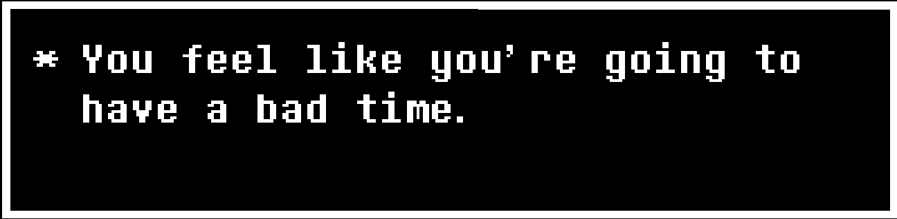

# [Undertale Text Box](https://sans-script.github.io/undertale-text-box/)

This project creates a simple text animation inspired by the game Undertale using HTML, CSS and JavaScript.

## Description

The Undertale Text Animation project simulates text appearing character by character, resembling the iconic text style from the game Undertale. It uses HTML, CSS, and JavaScript to achieve the animation effect.

## Preview

## How it Works

The main text animation is created through JavaScript. The text is defined in the script, and each character is displayed with a slight delay, providing a dynamic and engaging visual effect.

## Installation

To run this project, you need to install the Determination Sans Web font on your computer.

